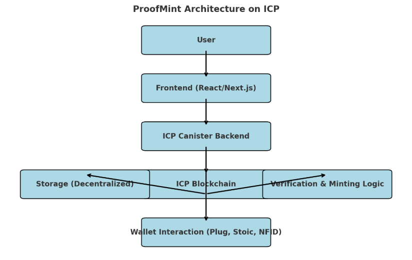

# ProofMint

Welcome to **ProofMint**, a decentralized platform on the **Internet Computer (ICP)** network. ProofMint leverages **canisters** to enable seamless minting, verification, and management of digital proofs. 

## About ProofMint

ProofMint is designed to provide a **trustless, verifiable, and efficient** way to mint and manage digital proofs. Built on ICP, it ensures security, decentralization, and scalability.

## Architecture Overview

The following flowchart illustrates the architecture of ProofMint and its interaction with the ICP network:




### Key Components:

- User Interaction: Users connect their wallets (Plug, Stoic, NFID) and interact with the frontend.

- Frontend (React/Next.js): Provides the UI and handles interactions with the backend.

- ICP Canister Backend: Executes minting, verification, and proof management logic.

- ICP Blockchain: Ensures decentralized execution and storage.

- Decentralized Storage: Stores NFT metadata securely on ICP.

- Verification & Minting Logic: Validates digital proofs before minting NFTs.

## Getting Started

To begin working with **ProofMint**, explore the project directory structure and configuration files. This will help you understand how the backend canister operates.

For more details, refer to the following ICP documentation:

- [Quick Start Guide](https://internetcomputer.org/docs/current/developer-docs/setup/deploy-locally)
- [SDK Developer Tools](https://internetcomputer.org/docs/current/developer-docs/setup/install)

## Running the Project Locally

To test ProofMint on your local machine, follow these steps:

```bash
# Navigate into the project directory
cd proofmint/

# Start the ICP replica in the background
dfx start --background

# Deploy your canisters to the local replica
dfx deploy
